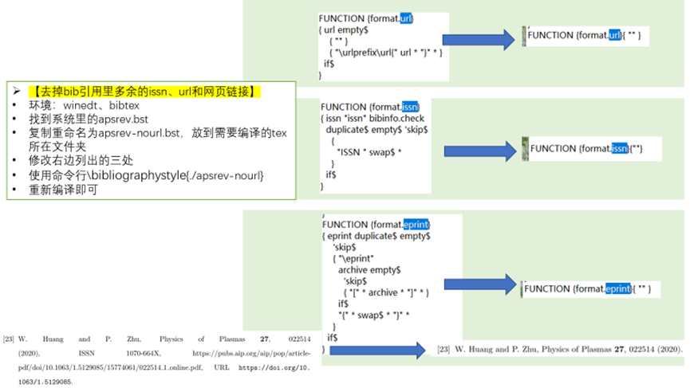

# Latex编译
[[toc]]

### 1. 编译latex的bib（用winedt）
- 先编译tex 产生aux，再用Bibtex编译bib，会自动生成bbl
- 最后点两次tex的编译就ok

### 2. 另起一页page
- \clearpage
- \newpage
 
### 3. Latex报错too many unprocessed floats
- 报错：当latex文件里面一个章节放的图表太多（超过18个）时，编译的时候会报错： Too many unprocessed floats。
- 原因：latex会把不能处理的浮动的图形放到 “未处理浮动图形队列”里，该队列最多放18个浮动图形，如果多于18个，就会报错
- 解决方法：在18个图之后添加\clearpage

### 4. 去掉bib引用里多余的issn、url和网页链接方法
- 环境：winedt、bibtex
- 找到系统里的apsrev.bst
- 复制重命名为apsrev-nourl.bst，放到需要编译的tex所在文件夹
- 修改右边列出的三处
- 使用命令行\bibliographystyle{./apsrev-nourl}
- 重新编译即可

### 5. latex里英文的双引号
- 英文模式下，tab键上面的键按两下``是前双引号
- 两个单引号''是后双引号

### 6. ppt/Beamer主题样式
- [参考](https://blog.csdn.net/zhouxiaowei1120/article/details/82818295)

