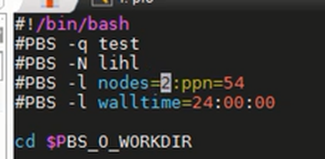

# 集群常用操作
[[TOC]]
## qsub提交任务+PBS常用操作

- 直接给出提交作业脚本batch.dat文件

  ```bash
  -q test #这个不变就可以了  q:queen序列
  -N *** #可以自行修改
  #nodes：需要申请的节点数
  #ppn：每个节点上需要申请的CPU数
  #总核数=nodes×ppn
  ```
- 对于NIMROD计算
  - 总核数是 nxbl×nybl×nlayers的公约数
  - 总核数是nlayers的倍数
  - 设置好之后保存退出，命令行输入qsub batch.dat

- PBS常用操作
  - PBS（Portable Batch System）是一种广泛应用于高性能计算（HPC）领域的作业管理系统，主要用于管理和调度计算资源。它支持批处理作业、交互式作业以及并行作业（如MPI、PVM等），能够高效地分配和控制计算任务。
  - 常用命令
      ```bash
      qsub 文件名.pbs/sh #(提交任务)

      qstat #(列出状态)

      qdel jobid #(取消任务)；删除自己上传上去的任务：qdel +任务id，eg：qdel 29843

      showq #展示终端计算机上目前运行、排队的情况
      # idle jobs 等待当中的作业；PROC：用了16个核；WCLIMIT：等待时间一天；QUEUETIME：提交算例时的时间

      ssh 某节点 #(转到某节点) 
      # 在hpc上 ssh node1或者node2 3 4 5 6就可以登录到节点上面计算
      # 如果不qsub，也不ssh nodex，那就是在自己的登录节点上计算，这样有可能影响到别人的登录，会卡顿等等
      # 所里大集群交作业ssh -Y -C mu01

      ```
  - 其他命令
      ```bash
      pbsnodes #(查看所有节点，有几个，叫什么)
      pbsnodes-l free #(查看空闲节点)
      pbsnodes某节点 #(查看某节点状态)
      exit #(离开节点)
      qstat -q #(列出队列)
      qstat -n #(列出队列中使用的节点）
      qstat -f jobid #(查看jobid任务的详细信息)
      ```
    - 其中qstat：用于查询作业状态信息
      - 命令格式：qstat[-fl][-al][-il][-n][-s][-R][-Q][-q][-B][-u]
      - 参数说明：
    ```
    -f jobid列出指定作业的信息
    -a 列出系统所有作业
    -i 列出不在运行的作业
    -n 列出分配给此作业的结点
    -s 列出队列管理员与scheduler所提供的建议
    -R 列出磁盘预留信息
    -Q 操作符是destinationid，指明请求的是队列状态
    -q 列出队列状态，并以alternative形式显示
    -au userid 列出指定用户的所有作业
    -B 列出 PBS Server 信息
    -r 列出所有正在运行的作业
    -Qf queue 列出指定队列的信息
    -u 若操作符为作业号，则列出其状态。若操作符为destinationid，则列出运行在其上的属于user_list中用户的作业状态。
    ```

## screen后台执行
- 提交作业【在关闭本地电脑的情况下，远程服务器仍然工作】
- >语法：screen -S screen-name
- eg:screen -S fyma_test1
- Ctrl+a+d 暂时先离开，但是这个计算还是在继续
- Ctrl+d 杀死/停止这个计算（有点类似于Ctrl+c）

【还要补充截图】

## tmux后台执行
【还要补充】

## 其他常用命令
### 1.tail
- 提交任务之后显示一些信息
- tail -f nimrod.out（相当于之前拿./nimrod-ser输出的那些信息）

### 2. sensors：查看集群温度

### 3. last -n 10：查看最近登录的十个人

### 4. users：查看正在登录的用户

### 5. 查看内存
- du -sh 查看本目录下面的总内存
- df -h 查看集群各个盘的内存大小


