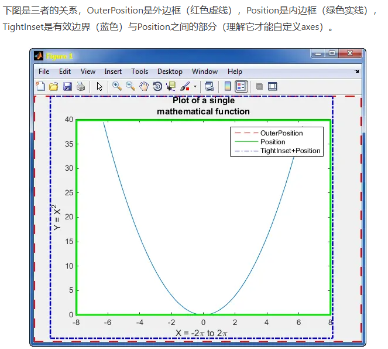

# Matlab
[[toc]]

## 画布大小、标签位置和留白控制等
### 1. 设置绘图区域大小、控制留白区域
- figure如同一张画布，axes是坐标轴用来控制所画图的位置和大小
- 在Location and Size中可以看到主要有：Position、TightInset和OuterPosition

```matlab
set(gca,'xtick',0:0.1:0.5,'unit','centimeters','position',[2.8,1.83,12.54,10]);
% gca中的a表示axes
% 指定绿色绘图区的位置和大小
%[相对figure窗口左边框的距离，下边框的距离，长，宽(可以设置成归一化或以cm为单位的)]

set(gcf,'Position',[200,200,600,480]); 
% 指定figure窗口的位置和大小
%[相对电脑显示器左边框的距离，下边框的距离，长，宽]
%gcf中的f表示figure；
```
- 红色虚线和蓝色虚线之间是留白区域，可用以下命令删去留白区域
```matlab
set(gca,...,'looseInset',[0 0 0 0]); % Expand axes to fill figure

set(gca,'LooseInset',get(gca,'TightInset')) % 去除不是很彻底
```
- [参考1](https://www.jianshu.com/p/b43937634d76)；[参考2](https://blog.csdn.net/shanchuan2012/article/details/53980288)

### 2. 改变x轴位置、方向
``` matlab
set(gca,'XAxisLocation','bottom'); %将x轴的位置设置在底部(默认)
set(gca,'XAxisLocation','top'); %将x轴的位置设置在顶部
set(gca,'XAxisLocation','origin'); %将x轴的位置设置在y=0处

set(gca,'XDir','normal'); %将x轴方向设置为普通(从左到右递增)
set(gca,'XDir','reverse'); %将x轴方向设置为反向(从右到左递增)
```
- 如果要改变y轴位置，把上面的X改成Y即可

### 3. 设置坐标label位置
```matlab
ylabel('Latitude()','fontsi',20,'position',[-0.13 0.18]);
%-0.13为距离坐标轴的水平距离，右侧为正，左侧为负
%0.18为上下距离，上侧为正，下侧为负（下侧基本用不到）
```

### 4. 两行legend

### 5. subplot多幅图中间不留空白（共用一个x轴/xlabel；上下叠加；坐标轴重合）
```matlab
subplot(3,1,1)
…
set(gca,'xticklabel',[]);
set(gca,'position',[0.15 0.65 0.75 0.27]);%[a b w h]=[左下角x 左下角y 宽度 高度]；图的高度为0.27

subplot(3,1,2)
…
set(gca,'xticklabel',[]);
set(gca,'position',[0.15 0.38 0.75 0.27]); %0.65-0.38=0.27；图的高度为0.27

subplot(3,1,3)
…
set(gca,'xticklabel',[]);
set(gca,'position',[0.15 0.11 0.75 0.27]);%0.38-0.11=0.27；图的高度为0.27
```
- [更多参考](https://blog.csdn.net/sinat_32602421/article/details/103831486)


## 颜色、线型、标记
### 1. 颜色
- [参考](https://blog.csdn.net/qq_38882446/article/details/100886087)

### 2. 指定绘图中的线和标记的外观（线型，Maker形状、大小）
``` matlab
plot(x,y,'o','Markersize',12)
```
- -实线（默认） --虚线   :点线   -. 点划线
- o圆圈   +加号   *星号   .点
- x叉号   s方形   d菱形
- ^上三角   v下三角   >右三角   <左三角
- p五角形   h六角形
- [更多Matlab官方参考](https://ww2.mathworks.cn/help/matlab/creating_plots/specify-line-and-marker-appearance-in-plots.html?searchHighlight=marker&s_tid=srchtitle_support_results_4_marker)


## 其他常用小技巧
### 1. 画直线（水平线、垂线）
``` matlab
plot([3,3],[0,5],'k') %从(3,0)点到(3,5)点的黑色竖线
plot([0,3],[0,0],'r') %从(0,0)点到(3,0)点的红色横线
plot([3,5],[5,5],'r') %从(3,5)点到(5,5)点的红色横线
plot([横坐标变化范围],[纵坐标变化范围])
```
### 2. 用Latex编译title、legend或label
- 语法：***('$Latex公式/符号$'，'Interpreter','latex'，balabala)
```matlab
% 标题
title('$\frac{sin(x)}{x}$','Interpreter','latex','FontSize',18);

% 图例
legend('$\frac{sin(x)}{x}$','Interpreter','latex','FontSize',18);

% 坐标轴
xlabel('$\alpha$','interpreter','latex','FontSize',18);
```
- [更多参考](https://blog.csdn.net/XSTX1996/article/details/81627219)

### 3. 转义（比如将下划线显示出来）
- 'Interpreter','none'
```matlab
title('xxx_i') %显示效果是i作为右下角角标出现
title('xxx_i','Interpreter','none') %显示效果就是xxx_i，下划线能显示出来
```

### 4. 将图存为pdf（高清矢量图）
- 有时候另存为pdf实际上存的是图片而非矢量格式
- 可以用以下命令行或者点击图片属性，修改相应的设置来解决问题
```matlab
figure(1)
fig1=figure(1);
fig1.Renderer='Painters';
```


