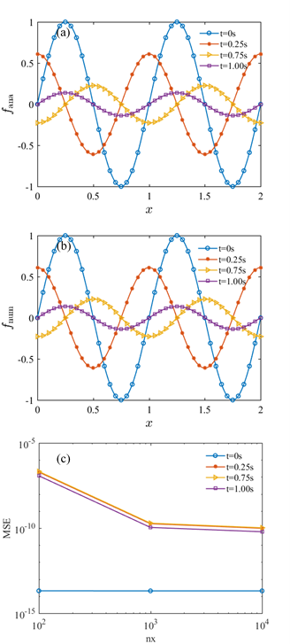

# CN差分格式求解偏微分方程

这里涉及到[三对角矩阵求解](/study_note/pursue_Matrix)
[[toc]]

## 举例1：无源项的对流扩散方程+自由边界条件
### 初值问题
- 从最基本的一维、稳态、无源项的对流扩散方程出发
$$\frac{\partial u}{\partial t}+\nu\frac{\partial u}{\partial x}=\mu \frac{\partial^2 u}{\partial x^2}, \quad 0\le x \le 2$$

- 初始条件：$u(x,t=0)=U_0 \sin(2\pi x)$

- 边界条件：$\left\{\begin{array}{ll}u(x=0,t)=e^{-4\mu\pi^2t}U_0 \sin(-2\pi \nu t) \\ u(x=2,t)=e^{-4\mu\pi^2t}U_0 \sin(2\pi(2-\nu t))\end{array}\right.$

- 物理量：对流系数$\nu=1\rm{m/s}$，扩散系数$\mu=0.05\rm{m^2/s}$，流速$U_0=0.5\rm{m/s}$，时间跨度$t\in[0,1s]$

### 离散化
- 采用GN(\alpharank-Nicolson)格式进行离散

- 用$u_i^k$表示流速，其中下标$i$、上边$k$分别表示空间和时间网格

- 等号左边第一项，$\frac{\partial u}{\partial t}$，可以离散为
$$\frac{1}{2}\left[\frac{u_i^{k+1}-u_i^{k+\frac{1}{2}}}{\Delta t /2}+\frac{u_i^{k+\frac{1}{2}}-u_i^{k}}{\Delta t/2}\right]=\frac{u_i^{k+1}-u_i^{k}}{\Delta t}$$

- 等号左边第二项，$\frac{\partial u}{\partial x}$，可以离散为
$$
\frac{1}{2}\left(\frac{u_{i+1}^{k+1}-u_{i-1}^{k+1}}{2\Delta x}+\frac{u_{i+1}^k-u_{i-1}^k}{2\Delta x}\right)
$$
- 等号右边项的$\frac{\partial^2 u}{\partial x^2}$可以离散为
$$\begin{align}
\frac{1}{2}\left[\frac{\frac{u_{i+1}^{k+1}-u_i^{k+1}}{\Delta x}-\frac{u_i^{k+1}-u_{i-1}^{k+1}}{\Delta x}}{\Delta x}+\frac{\frac{u_{i+1}^k-u_i^k}{\Delta x}-\frac{u_i^k-u_{i-1}^k}{\Delta x}}{\Delta x}\right] \\=\frac{\left(u_{i+1}^{k+1}-{2u}_i^{k+1}+u_{i-1}^{k+1}\right)+\left(u_{i+1}^k-2u_i^k+u_{i-1}^k\right)}{2\left(\Delta x\right)^2} 
\end{align}$$

- 因此方程可以离散化为
$$\begin{align}
\frac{u_i^{k+1}-u_i^{k}}{\Delta t}+\frac{\nu}{2}\left(\frac{u_{i+1}^{k+1}-u_{i-1}^{k+1}}{2\Delta x}+\frac{u_{i+1}^k-u_{i-1}^k}{2\Delta x}\right)\\=\mu\frac{\left(u_{i+1}^{k+1}-{2u}_i^{k+1}+u_{i-1}^{k+1}\right)+\left(u_{i+1}^k-2u_i^k+u_{i-1}^k\right)}{2\left(\Delta x\right)^2} 
\end{align}$$

- 为了方便，令$\alpha=\frac{\mu\Delta t}{\left(\Delta x\right)^2}$，$\beta=\frac{\nu\Delta t}{2\Delta x}$，则可以进一步整理为
$$\begin{align}
\left(\frac{\alpha}{2}+\frac{\beta}{2}\right)u_{i-1}^{k+1}-\left(\alpha+1\right)u_i^{k+1}+\left(\frac{\alpha}{2}-\frac{\beta}{2}\right)u_{i+1}^{k+1}\\ =-\left(\frac{\alpha}{2}+\frac{\beta}{2}\right)u_{i-1}^k+\left(\alpha-1\right)u_i^k-\left(\frac{\alpha}{2}-\frac{\beta}{2}\right)u_{i+1}^k
\end{align}$$

- 注意，本例子的两个边界条件是直接给出的

- 将离散结果写为矩阵格式
$$\begin{align}
\left[\begin{matrix}1&0&0&0&\cdots&0\\\color{magenta}\left(\frac{\alpha}{2}+\frac{\beta}{2}\right)&\color{red}-\left(\alpha+1\right)&\color{green}\left(\frac{\alpha}{2}-\frac{\beta}{2}\right)&0&\cdots&0\\0&\color{blue}\left(\frac{\alpha}{2}+\frac{\beta}{2}\right)&\color{red}-\left(\alpha+1\right)&\color{green}\left(\frac{\alpha}{2}-\frac{\beta}{2}\right)&\cdots&0\\\vdots&\vdots&\ddots&\ddots&\ddots&\vdots\\0&0&\cdots&\color{blue}\left(\frac{\alpha}{2}+\frac{\beta}{2}\right)&\color{red}-\left(\alpha+1\right)&\color{magenta}\left(\frac{\alpha}{2}-\frac{\beta}{2}\right)\\0&0&\cdots&0&0&1\\\end{matrix}\right]
\left[\begin{matrix}\color{magenta}u_1^{k+1}\\u_2^{k+1}\\\begin{matrix}u_3^{k+1}\\\vdots\\\begin{matrix}u_{N-1}^{k+1}\\\color{magenta}u_N^{k+1}\\\end{matrix}\\\end{matrix}\\\end{matrix}\right]\\
=\left[\begin{matrix} e^{-4\mu\pi^2t}U_0 \sin(-\nu t^k)\\
-\left(\frac{\alpha}{2}+\frac{\beta}{2}\right)u_1^k+\left(\alpha-1\right)u_2^k-\left(\frac{\alpha}{2}-\frac{\beta}{2}\right)u_3^k\\
\begin{matrix}-\left(\frac{\alpha}{2}+\frac{\beta}{2}\right)u_2^k+\left(\alpha-1\right)u_3^k-\left(\frac{\alpha}{2}-\frac{\beta}{2}\right)u_4^k\\
\vdots\\
\begin{matrix}-\left(\frac{\alpha}{2}+\frac{\beta}{2}\right)u_{N-2}^k+\left(\alpha-1\right)u_{N-1}^k-\left(\frac{\alpha}{2}-\frac{\beta}{2}\right)u_N^k\\
e^{-4\mu\pi^2t}U_0 \sin(2-\nu t^k)\\
\end{matrix}\\\end{matrix}\\\end{matrix}\right]
\end{align}$$
注意：矩阵为$N\times N$的矩阵，$k$ 时刻的流速信息$u_{i}^k$是已知的，现在需要求解的是$k+1$时刻的结果$u_{i}^{k+1}$


### 调整为三对角矩阵格式
- 由于左右两个边界的解是明确的，不需要再进行求解（同时也是为了将矩阵调整成“三对角格式），实际求解的是

$$\begin{align}
\left[\begin{matrix}\color{red}-\left(\alpha+1\right)&\color{green}\left(\frac{\alpha}{2}-\frac{\beta}{2}\right)&0&\cdots&0\\\color{blue}\left(\frac{\alpha}{2}+\frac{\beta}{2}\right)&\color{red}-\left(\alpha+1\right)&\color{green}\left(\frac{\alpha}{2}-\frac{\beta}{2}\right)&\cdots&0\\\vdots&\ddots&\ddots&\ddots&\vdots\\0&\cdots&0&\color{blue}\left(\frac{\alpha}{2}+\frac{\beta}{2}\right)&\color{red}-\left(\alpha+1\right)\\\end{matrix}\right]
\left[\begin{matrix}u_2^{k+1}\\\begin{matrix}u_3^{k+1}\\\vdots\\\begin{matrix}u_{N-1}^{k+1}\\\end{matrix}\\\end{matrix}\\\end{matrix}\right]\\
=\left[\begin{matrix} 
-\left(\frac{\alpha}{2}+\frac{\beta}{2}\right)u_1^k+\left(\alpha-1\right)u_2^k-\left(\frac{\alpha}{2}-\frac{\beta}{2}\right)u_3^k\color{magenta}-\left(\frac{\alpha}{2}+\frac{\beta}{2}\right)u_1^{k+1}\\
\begin{matrix}-\left(\frac{\alpha}{2}+\frac{\beta}{2}\right)u_2^k+\left(\alpha-1\right)u_3^k-\left(\frac{\alpha}{2}-\frac{\beta}{2}\right)u_4^k\\
\vdots\\
\begin{matrix}-\left(\frac{\alpha}{2}+\frac{\beta}{2}\right)u_{N-2}^k+\left(\alpha-1\right)u_{N-1}^k-\left(\frac{\alpha}{2}-\frac{\beta}{2}\right)u_N^k\color{magenta}-\left(\frac{\alpha}{2}-\frac{\beta}{2}\right)u_{N}^{k+1}\\
\end{matrix}\\\end{matrix}\\\end{matrix}\right]
\end{align}$$
注意，此时矩阵为$N-2\times N-2$的矩阵（去掉了第一行、第一列与最后一行、最后一列），格式上与[追赶法解三对角矩阵](/study_note/pursue_Matrix)中最开始出发的$AU=R$ 一致

### 程序实现
- 主程序
``` 
        program main
        implicit none

        integer i,n,time
        real coeff_nu,coeff_mu,U0,dx,xmax,dt,tmax,m,p
        real,save::time_in
        real,parameter::pai=3.141592653589793
        integer nx,nt
        real,allocatable::x(:),e(:),b(:),c(:),t(:)
        real,allocatable::u(:,:)
        character(len=10)::time_cha

        !-----参数设置-----
        NAMELIST /paras/time_in !计划存储的时刻
        open(118,file='./params.dat')
        read(118,paras)
        close(118)
        print*,'time=',time_in
        coeff_nu=1
        coeff_mu=0.05
        U0=0.5

        !-----空间、时间网格-----
        dx=0.02
        xmax=2 !右边界
        nx=nint(xmax/dx)+1
        allocate(x(nx))
        do i=1,nx
         x(i)=(i-1)*dx
        end do
        dt=0.002
        tmax=1 !最大时刻
        nt=nint(tmax/dt)+1
        allocate(t(nt))
        do i=1,nt
         t(i)=(i-1)*dt
        end do
        print*,'nx      =',nx
        print*,'nt      =',nt
        allocate(u(nx,nt),e(nx),b(nx),c(nx))
        m=coeff_D*dt/dx**2
        p=coeff_U*dt/2/dx

        !-----初始条件、边界条件-----
        do i=1,nx
          u(i,1)=U0*sin(2*pai*x(i))
        end do
        do i=1,nt
          u(1,i)=U0*sin(2*pai*(x(1)-coeff_U*t(i)))
     &*exp(-4*coeff_D**pai**2*t(i))
          u(nx,i)=U0*sin(2*pai*(x(nx)-coeff_U*t(i)))
     &*exp(-4*coeff_D**pai**2*t(i))
        end do
        print*,'u(1,1),u(nx,1)=',u(1,1),u(nx,1)

        open(unit=11,file='CN_result_t_1.txt ')
        do i = 1,nx
         write(11,*)(i-1)*dx,u(i,1)!存储初始时刻的u
        end do
        close(11)

        !-----矩阵-----
        do i=1,nx !这里其实不需要循环
          e(:)=m/2+p/2
          b(:)=-(m+1)
          c(:)=m/2-p/2
        end do

        !-----求解-----
        do n=1,nt-1
          call CNsolve(u,e,b,c,nx,nt,n,m,p)
        end do

        !-----存储想要记录时刻的u-----
        time=time_in/dt+1 !转换成时间步
        write(time_cha,'(I4)'),time
        open(unit=11,file='CN_result_t_'//trim(adjustl(time_cha))//
     &'.txt')
        do i = 1,nx
         write(11,*)(i-1)*dx,u(i,time)
        end do
        close(11)

        stop
        end program
```
- 子程序CNsolve，延续[追赶法解三对角矩阵](/study_note/pursue_Matrix)“伪代码”的逻辑
``` fortran

        subroutine CNsolve(u,e,b,c,ny,nt,n,w,p)
        implicit none

        integer i
        integer n,ny,nt
        real w,p
        real::e(ny),b(ny),c(ny),y(ny),f(ny)
        real::L(ny),M(ny)
        real::u(ny,nt)

        M(2)=b(2)!实际求解的三对角矩阵是N-2 x N-2的，所以这里求解2到N-2的M 
        do i=3,ny-1
         L(i)=e(i)/M(i-1)
         M(i)=b(i)-L(i)*c(i-1)
        end do

        f(2)=(w-1)*u(2,n)-(w/2+p/2)*u(1,n)-(w/2-p/2)*u(3,n)
     &-(w/2+p/2)*u(1,n+1)
        f(ny-1)= (w-1)*u(ny-1,n)-(w/2+p/2)*u(ny-2,n)-(w/2-p/2)*u(ny,n)
     &-(w/2-p/2)*u(ny,n+1)
        do i = 3,ny-2
         f(i)=(w-1)*u(i,n)-(w/2+p/2)*u(i-1,n)-(w/2-p/2)*u(i+1,n)
        end do

        y(2)=f(2)
        do i=3,ny-1
         y(i)=f(i)-L(i)*y(i-1)
        end do

        u(ny-1,n+1)=y(ny-1)/M(ny-1)
        do i=ny-2,2,-1
         u(i,n+1)=(y(i)-c(i)*u(i+1,n+1))/M(i)
        end do

        end subroutine CNsolve
```

### 计算结果
- 方程的解析解为$u(x,t)=e^{-4\mu\pi^2t}U_0 \sin(2\pi(x-\nu t))$

- 以下为结果对比对比

  - 图中的 $f$ 即为 $u$ .
  - 图(a)(b)分别展示了网格数 $\rm{nx}={10}^2$ 时的解析解、数值解，图(c)是不同网格数$(\rm{nx}={10}^2,10^3,{10}^4)$时两者的均方误差(MSE).
  - 可见随着网格数增加误差是收敛的.


## 举例2：有源项的对流扩散方程+第一类、第二类边界条件
### 初值问题
- 考虑一维、有源项的对流扩散方程出发，且边界条件为第一类、第二类边界条件的形式
$$\frac{\partial u}{\partial t}-\frac{\nu}{x}\frac{\partial u}{\partial x}-\nu \frac{\partial^2 u}{\partial x^2}=\frac{T_{s}}{x}, \quad 0\le x \le 1$$

- 初始条件：$u(x,t=0)=0$

- 边界条件：$\left\{\begin{array}{ll}\frac{\partial u(x=0,t)}{\partial x}=0 \\ u(x=1,t)=0\end{array}\right.$

- $T_{s}(x)$ 为源项，在这里以高斯分布为例。$T_{s}(x)=T_0 g(x)=T_0 ae^{-\frac{\left(x-b\right)^2}{2c^2}}$，其中$a$表示高斯函数的幅度，$b$表示高斯函数对称中心，也是尖峰所在位置，$c$为标准方差，表征高斯分布的宽度/胖瘦。

- 物理量：$\nu=100, T_0=-957.38, a=\frac{1}{\sigma\sqrt{2\pi}}, b=0.775, c=\sigma=0.001$

### 离散化
- 方程中的$\frac{\partial u}{\partial t}$，$\frac{\partial u}{\partial x}$以及$\frac{\partial^2 u}{\partial x^2}$ 的离散化方式与举例1完全一致

- 方程可以离散化为
$$\begin{align}
\frac{u_i^{k+1}-u_i^{k}}{\Delta t}-\frac{\nu}{2 x_i}\left(\frac{u_{i+1}^{k+1}-u_{i-1}^{k+1}}{2\Delta x}+\frac{u_{i+1}^k-u_{i-1}^k}{2\Delta x}\right)\\-\mu\frac{\left(u_{i+1}^{k+1}-{2u}_i^{k+1}+u_{i-1}^{k+1}\right)+\left(u_{i+1}^k-2u_i^k+u_{i-1}^k\right)}{2\left(\Delta x\right)^2}= \frac{T_s(x_i)}{x_i}
\end{align}$$

- 为了方便，令$\alpha=\frac{\nu\Delta t}{\left(\Delta x\right)^2}$，$\beta=-\frac{\nu\Delta t}{2\Delta x}$，则可以进一步整理为
$$\begin{align}
\left(\frac{\alpha}{2}+\frac{\beta}{2x_i}\right)u_{i-1}^{k+1}-\left(\alpha+1\right)u_i^{k+1}+\left(\frac{\alpha}{2}-\frac{\beta}{2x_i}\right)u_{i+1}^{k+1}\\ =-\left(\frac{\alpha}{2}+\frac{\beta}{2x_i}\right)u_{i-1}^k+\left(\alpha-1\right)u_i^k-\left(\frac{\alpha}{2}-\frac{\beta}{2x_i}\right)u_{i+1}^k - \frac{\Delta t T_s(x_i)}{x_i}
\end{align}$$

- 左边界$\frac{\partial u(x=0,t)}{\partial x}=0$ 的离散化
根据中心差分，有$u_2=u_0$，代入上式，并且令$i=1$，整理可得
$$
\alpha u_2^{n+1}-\left(\alpha+1\right)u_1^{n+1}=-{\alpha u}_2^n+\left(\alpha-1\right)u_1^n- \frac{\Delta t T_s(x_1)}{x_1}
$$

- 右边界 $u(x=1,t)=0$ 的离散化
$$
u_N=0
$$

- 将离散结果写为矩阵格式
$$\begin{align}
\left[\begin{matrix}\color{red}-(\alpha+1)&\color{green}\alpha&0&0&\cdots&0\\\color{blue}\left(\frac{\alpha}{2}+\frac{\beta}{2x_2}\right)&\color{red}-\left(\alpha+1\right)&\color{green}\left(\frac{\alpha}{2}-\frac{\beta}{2x_2}\right)&0&\cdots&0\\0&\color{blue}\left(\frac{\alpha}{2}+\frac{\beta}{2x_3}\right)&\color{red}-\left(\alpha+1\right)&\color{green}\left(\frac{\alpha}{2}-\frac{\beta}{2x_3}\right)&\cdots&0\\\vdots&\vdots&\ddots&\ddots&\ddots&\vdots\\0&0&\cdots&\color{blue}\left(\frac{\alpha}{2}+\frac{\beta}{2x_{N-1}}\right)&\color{red}-\left(\alpha+1\right)&\color{magenta}\left(\frac{\alpha}{2}-\frac{\beta}{2x_{N-1}}\right)\\0&0&\cdots&0&0&1\\\end{matrix}\right]
\left[\begin{matrix}u_1^{k+1}\\u_2^{k+1}\\\begin{matrix}u_3^{k+1}\\\vdots\\\begin{matrix}u_{N-1}^{k+1}\\\color{magenta}u_N^{k+1}\\\end{matrix}\\\end{matrix}\\\end{matrix}\right]\\
=\left[\begin{matrix} -{\alpha u}_2^n+\left(\alpha-1\right)u_1^n- \frac{\Delta t T_s(x_1)}{x_1}\\
-\left(\frac{\alpha}{2}+\frac{\beta}{2x_2}\right)u_1^k+\left(\alpha-1\right)u_2^k-\left(\frac{\alpha}{2}-\frac{\beta}{x_2}\right)u_3^k - \frac{\Delta t T_s(x_2)}{x_2}\\
\begin{matrix}-\left(\frac{\alpha}{2}+\frac{\beta}{2x_3}\right)u_2^k+\left(\alpha-1\right)u_3^k-\left(\frac{\alpha}{2}-\frac{\beta}{2x_3}\right)u_4^k - \frac{\Delta t T_s(x_3)}{x_3}\\
\vdots\\
\begin{matrix}-\left(\frac{\alpha}{2}+\frac{\beta}{2x_{N-1}}\right)u_{N-2}^k+\left(\alpha-1\right)u_{N-1}^k-\left(\frac{\alpha}{2}-\frac{\beta}{2{N-1}}\right)u_N^k - \frac{\Delta t T_s(x_{N-1})}{x_{N-1}}\\
0\\
\end{matrix}\\\end{matrix}\\\end{matrix}\right]
\end{align}$$
注意：矩阵为$N\times N$的矩阵

### 调整为三对角矩阵格式
$$\begin{align}
\left[\begin{matrix}\color{red}-(\alpha+1)&\color{green}\alpha&0&0&\cdots&0\\
\color{blue}\left(\frac{\alpha}{2}+\frac{\beta}{2x_2}\right)&\color{red}-\left(\alpha+1\right)&\color{green}\left(\frac{\alpha}{2}-\frac{\beta}{2x_2}\right)&0&\cdots&0\\0&\color{blue}\left(\frac{\alpha}{2}+\frac{\beta}{2x_3}\right)&\color{red}-\left(\alpha+1\right)&\color{green}\left(\frac{\alpha}{2}-\frac{\beta}{2x_3}\right)&\cdots&0\\\vdots&\vdots&\ddots&\ddots&\ddots&\vdots\\0&\cdots&0&0&\color{blue}\left(\frac{\alpha}{2}+\frac{\beta}{2 x_{N-1}}\right)&\color{red}-\left(\alpha+1\right)\\\end{matrix}\right]
\left[\begin{matrix}u_1^{k+1}\\u_2^{k+1}\\\begin{matrix}u_3^{k+1}\\\vdots\\\begin{matrix}u_{N-1}^{k+1}\\\end{matrix}\\\end{matrix}\\\end{matrix}\right]\\
=\left[\begin{matrix}  -{\alpha u}_2^n+\left(\alpha-1\right)u_1^n- \frac{\Delta t T_s(x_1)}{x_1}\\
-\left(\frac{\alpha}{2}+\frac{\beta}{2x_2}\right)u_1^k+\left(\alpha-1\right)u_2^k-\left(\frac{\alpha}{2}-\frac{\beta}{2x_2}\right)u_3^k- \frac{\Delta t T_s(x_2)}{x_2}\\
\begin{matrix}-\left(\frac{\alpha}{2}+\frac{\beta}{2 x_3}\right)u_2^k+\left(\alpha-1\right)u_3^k-\left(\frac{\alpha}{2}-\frac{\beta}{2 x_3}\right)u_4^k- \frac{\Delta t T_s(x_3)}{x_3}\\
\vdots\\
\begin{matrix}-\left(\frac{\alpha}{2}+\frac{\beta}{2x_{N-1}}\right)u_{N-2}^k+\left(\alpha-1\right)u_{N-1}^k-\left(\frac{\alpha}{2}-\frac{\beta}{2x_{N-1}}\right)u_N^k- \frac{\Delta t T_s(x_{N-1})}{x_{N-1}}\color{magenta}-\left(\frac{\alpha}{2}-\frac{\beta}{2x_{N-1}}\right)u_{N}^{k+1}\\
\end{matrix}\\\end{matrix}\\\end{matrix}\right]
\end{align}$$
注意，此时矩阵为$N-1\times N-1$的矩阵（去掉了最后一行、最后一列）

### 程序实现
- 主程序
```
        program main
        implicit none

        integer i,n,time,mpsi
        real(8) coeff_nu,dx,xmax,dt,tmax,m,p
        real(8),save::time_in
        real(8),parameter::pai=3.141592653589793
        integer nx,nt
        real(8),allocatable::x(:),e(:),b(:),c(:),t(:)
        real(8),allocatable::u(:,:)
        character(len=10)::time_cha
        real(8),save:: T0=-957.38
        real(8) gauss_r,gauss_b,,gauss_c,temp_gauss
        real(8),allocatable::T_s_term(:)

        !-----参数设置-----
        NAMELIST /paras/mpsi,time_in
        open(118,file='./params.dat')
        read(118,paras)
        close(118)
        coeff_nu=100
        gauss_b=0.775
        gauss_c=0.001

        !-----空间、时间网格-----
        dx=1.0/mpsi
        xmax=1
        nx=nint(xmax/dx)+1
        allocate(x(nx))
        do i=1,nx
         x(i)=i*dx
        end do
        dt=0.00025
        tmax=1
        nt=nint(tmax/dt)+1
        allocate(t(nt))
        do i=1,nt
         t(i)=(i-1)*dt
        end do
        print*,'dx        =',dx
        print*,'nx        =',nx
        print*,'dt        =',dt
        print*,'nt        =',nt
        allocate(u(nx,nt),e(nx),b(nx),c(nx),T_s(nx))
        m=coeff_nu*dt/dx**2
        p=-coeff_nu*dt/2.0/dx
        print*,'m,p=',m,p

        !-----源项-----
        do i=1,nx
          temp_gauss=gauss_r(gauss_b,x(i),gauss_c)!gauss_r函数见后面
          T_s_term(i)=T0*dt/x(i)*temp_gauss
        end do


        !-----初始条件、边界条件-----
        do i=1,nx
          u(i,1)=0 !t=0时刻的分布
        end do
        do i=1,nt
          u(nx,i)=0 !右边界；左边界不在这里体现，是在三对角矩阵的处理中体现
        end do
    
        open(unit=11,file='CN_result_t_1.txt ')
        do i = 1,nx
         write(11,*)i*dx,u(i,1)
        end do
        close(11)

        !-----矩阵-----
        do i=1,nx
         e(i)=m/2+p/2/x(i)
         b(i)=-(m+1)
         c(i)=m/2-p/2/x(i)
        end do
         c(1)=m

        !-----求解-----
        do n=1,nt-1
         call CNsolve(u,e,b,c,x,nx,nt,n,m,p,T_mag)
        end do

        !-----存储想要记录时刻的u-----
        time=time_in*(nt-1)+1
        write(time_cha,'(I4)'),time
        open(unit=11,file='CN_result_t_'//trim(adjustl(time_cha))//
     &'.txt')
        do i = 1,nx
          write(11,*)i*dx,u(i,time)
        end do
        close(11)

        stop
        end program
```

- 子程序CNsolve
```
        subroutine CNsolve(u,e,b,c,x,ny,nt,n,w,p,Ts)
        implicit none

        integer i
        integer n,ny,nt,t
        real(8) w,p,temp
        real(8)::e(ny),b(ny),c(ny),y(ny),f(ny)
        real(8)::L(ny),M(ny)
        real(8)::u(ny,nt),x(ny)
        real(8) Ts(ny)

        M(1)=b(1)!实际求解的三对角矩阵是N-1 x N-1的，所以这里求解1到N-1的M
        do i=2,ny-1
          L(i)=e(i)/M(i-1)
          M(i)=b(i)-L(i)*c(i-1)
        end do

        f(1)=(w-1)*u(1,n)-w*u(2,n)-Ts(1)
        temp=(w-1)*u(ny-1,n)-(w/2+p/x(ny-1)/2)*u(ny-2,n)
     &-(w/2-p/x(ny-1)/2)*u(ny,n)-Ts(ny-1)
        f(ny-1)= temp-(w/2-p/x(ny-1)/2)*u(ny,n+1)
        do i = 2,ny-2
         f(i)=(w-1)*u(i,n)-(w/2+p/x(i)/2)*u(i-1,n)
     &-(w/2-p/x(i)/2)*u(i+1,n)-Ts(i)
        end do

        y(1)=f(1)
        do i=2,ny-1
         y(i)=f(i)-L(i)*y(i-1)
        end do

        u(ny-1,n+1)=y(ny-1)/M(ny-1)
        do i=ny-2,1,-1
         u(i,n+1)=(y(i)-c(i)*u(i+1,n+1))/M(i)
        end do

        end subroutine CNsolve
```

- 高斯分布子函数gauss_r()
```
        function gauss_r(bb,x,cc)

        real(8):: x,gauss_r
        real(8):: aa,bb,cc
        real(8),parameter::pai=3.1415926

        aa=1/cc/sqrt(2*pai)
        gauss_r=aa*exp(-(x-bb)**2/(2*cc**2))
        return

        end function gauss_r
```

### 计算结果
- 方程用Bessel展开的方式进行求解，可以得到近似的解析解
- 以下为结果对比

- (a)高斯分布$g(x)$
- (b)近似解析解
- (c)用如上差分方法求得的数值解
- 解析解与数值解($t=150\rm ms$)的均方误差与网格数的依赖关系